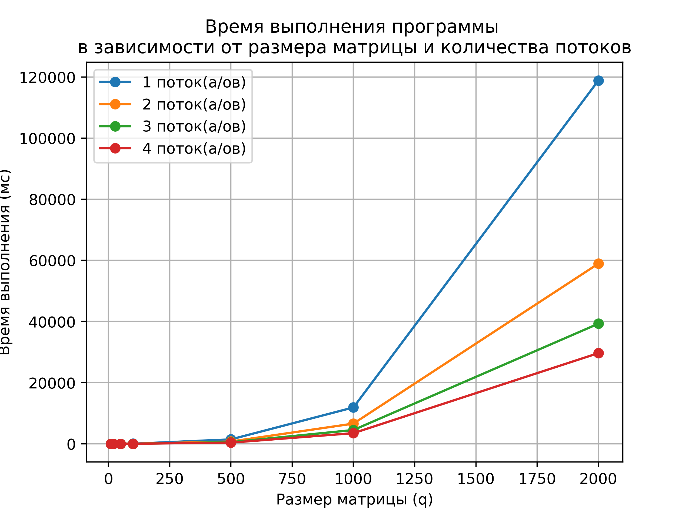
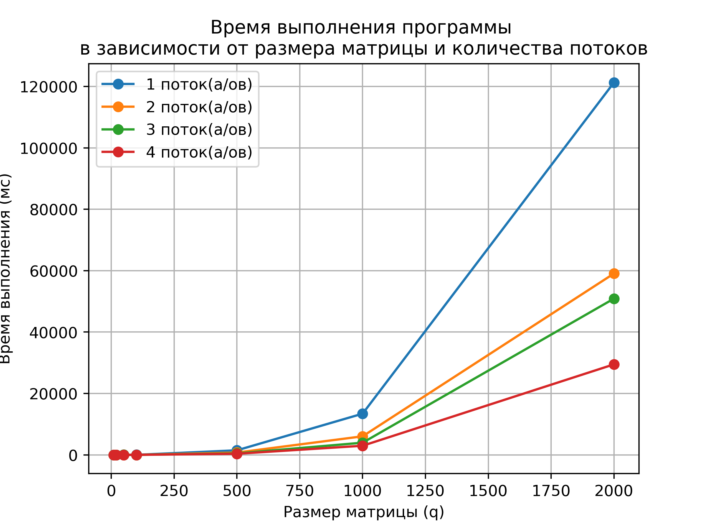
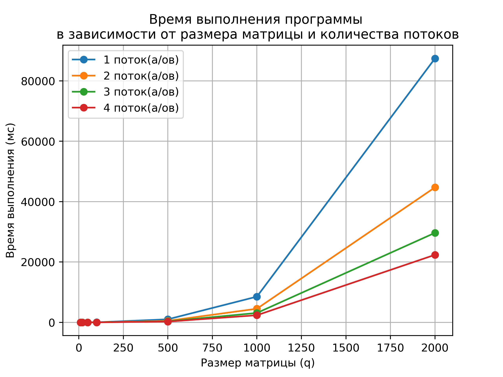

# Параллельные алгоритмы умножения матриц и их сравнение

### Как использовать?

```
mpic++ main.cpp -o main -lm
mpiexec -np <num_threads> ./main <matrix_size> <algo_name>

num_threads - ограничено количеством потоков на вашей машине
matrix_size - не ограничено (длина матрицы и по совместительству ширина)
algo_name - название алгоритма (одно из трёх: row, column, block)
```

Сначала я попытался написать алгоритмы используя матрицы на векторах, но у меня постоянно сыпались ошибки по памяти и я не мог понять в чем дело. В конце концов стало ясно, что MPI работает с одномерными массивами и пришлось написать класс реализующий матрицу в виде одномерного массива.

Дальше дело пошло лучше и были реализованы три алгоритма умножения матриц:

### С разбиением по строкам:
t - количество потоков
q - длина или ширина матрицы
ms - единицы измерения времени

|t\q |   10 |   20 |   50 |   100 |   500 |   1000 |   2000 |
|---:|-----:|-----:|-----:|------:|------:|-------:|-------:|
|  1 |    0 |    0 |    1 |    11 |  1426 |  11877 | 118857 |
|  2 |    0 |    0 |    0 |     5 |   734 |   6590 |  58937 |
|  3 |    0 |    0 |    0 |     4 |   505 |   4492 |  39280 |
|  4 |    0 |    0 |    0 |     3 |   368 |   3464 |  29652 |



### С разбиением по стобцам:
t - количество потоков
q - длина или ширина матрицы
ms - единицы измерения времени
|t\q |   10 |   20 |   50 |   100 |   500 |   1000 |   2000 |
|---:|-----:|-----:|-----:|------:|------:|-------:|-------:|
|  1 |    0 |    0 |    1 |    11 |  1480 |  13415 | 121309 |
|  2 |    0 |    0 |    0 |     6 |   744 |   6044 |  59075 |
|  3 |    0 |    0 |   12 |     4 |   483 |   3962 |  50902 |
|  4 |    1 |    0 |    4 |     3 |   361 |   2971 |  29483 |



### С разбиением по блокам:
t - количество потоков
q - длина или ширина матрицы
ms - единицы измерения времени
|t\q |   10 |   20 |   50 |   100 |   500 |   1000 |   2000 |
|---:|-----:|-----:|-----:|------:|------:|-------:|-------:|
|  1 |    0 |    0 |    1 |     9 |  1010 |   8512 |  87436 |
|  2 |    0 |    0 |    0 |     4 |   506 |   4509 |  44718 |
|  3 |    0 |    0 |    0 |     3 |   340 |   3108 |  29657 |
|  4 |    0 |    0 |    0 |     2 |   255 |   2356 |  22370 |



### Заключение:
Лучшим из всех алгоритмов оказался с разбиением по блокам. Он демонстрирует лучшее время на всех количествах потоков, особенно на большом количестве процессов. Однако, для получения наилучшей производительности требуется тщательный выбор размера блоков.

Алгоритмы разбиения по строкам и столбцам предоставляют хорошую производительность и подходят для небольшого числа процессов. Однако, они могут быть неэффективными для случаев, когда число строк (или столбцов) не делится нацело на число процессов. (неравномерное распределение нагрузки)

